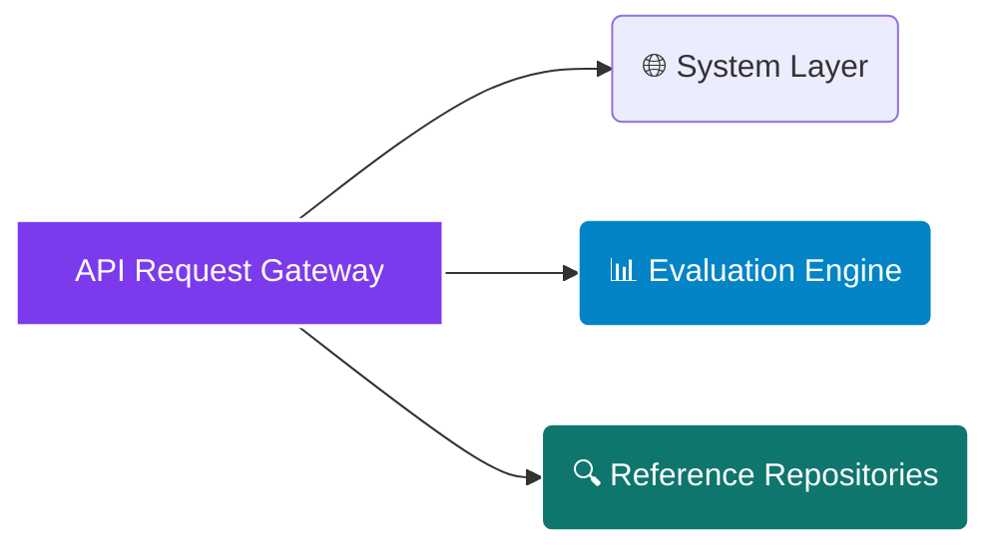

# <p align="center"></p>

<div align="center">

  <p><strong>Deterministic Multi-Stage Photovoltaic Sizing Engine, Real-Time Tariff Interrogation Mapping, and 25-Year Asset Yield Valuation Framework</strong></p>

</div>

<div align="center">

  <a href="https://rapidapi.com/bethelnedi/api/residential-solar-roi-api"></a>
  <a href="https://elements.stoplight.io/viewer/?spec=https://raw.githubusercontent.com/bethelhash/Residential-Solar-ROI-API/refs/heads/main/openapi.json"></a>
  
  
  

</div>

---

## ⚡ Executive Summary

The **Residential Solar ROI API** is an advanced physics-based microservice engineered to automate structural solar pre-feasibility analysis, financial asset underwriting, and investment modeling for any address across all 50 US states and Washington D.C. Developed for PropTech platforms, installer CRM networks, real estate development groups, and utility analyst suites, this API bypasses broad geographic averages to generate hyper-localized structural evaluations.

By running an address or targeted coordinates through localized **PVWatts V8 algorithms**, paired with multi-decadal **NASA MERRA-2 satellite solar resource data**, the calculation core builds a complete 25-year financial performance cash flow. It dynamically accounts for localized tiered electric utility schedules, shifting regional net-metering structures (such as California's **NEM 3.0 Avoided Cost rules**), and active tax credit step-downs in **under 450ms**.

<blockquote align="left">

  <strong>💎 AUDIT-READY ADVANCED ENGINEERING PHYSICS</strong><br>

  Unlike black-box calculators that hide assumptions, this infrastructure framework exposes an unshakeable, fully citation-backed audit trail. From HDKR diffuse plane-of-array conversions to King/Sandia cell operating temperature vectors and Jordan &amp; Kurtz module degradation paths, every physical metric matches industry-accepted standards and passes strict municipal due diligence reviews.

</blockquote>

---

## 🏛️ Enterprise Core Capabilities

<table width="100%">
  <tr>
    <td width="50%" valign="top">
      <h3>📈 Advanced Physics &amp; Yield Sizing</h3>
      <ul>
        <li><strong>Deterministic Production Modeling:</strong> Runs precise PVWatts V8 algorithms to determine realistic system yields based on azimuth, slope, and obstruction values.</li>
        <li><strong>Multi-Decadal Climate Streaming:</strong> Ingests NASA POWER MERRA-2 coordinates data to reflect 22-year average direct, diffuse, and global irradiance.</li>
        <li><strong>Semiconductor Degradation Controls:</strong> Models continuous performance drops over 25 years based on module material configurations (Mono-Si, Poly-Si, HJT, CdTe).</li>
      </ul>
    </td>
    <td width="50%" valign="top">
      <h3>🔌 Tariff Accounting &amp; Compliance</h3>
      <ul>
        <li><strong>Granular Utility Interrogation:</strong> Maps exact rate schedules for over 60 premier US providers using current EIA Form 861 structured files.</li>
        <li><strong>NEM 3.0 Avoided Cost Mapping:</strong> Avoids simplified credit assumptions by accurately modeling California's post-April 2023 grid export limits alongside explicit battery recommendation flags.</li>
        <li><strong>Full Upfront Incentive Stacking:</strong> Automatically applies federal investment tax credits (IRA 2022 Section 25D) alongside active state SREC values.</li>
      </ul>
    </td>
  </tr>
</table>

---

## 🗺️ Market Architecture Hub

### 🌍 Net Metering (NEM) Compliance Structures
The financial engine processes local utility tariffs against four explicit net energy rulesets:
`NEM 1.0 Full Retail (20+ States)` &middot; `NEM 3.0 Avoided Cost (CA)` &middot; `Net Billing (AZ, NV, UT)` &middot; `No Net Metering (TN, AL, MS)`

### 📊 Supported Solid-State Modules
Performance evaluations adapt cell temperature losses based on module construction profiles:
`Monocrystalline Si` &middot; `Polycrystalline Si` &middot; `Thin-Film CdTe (High-Heat Guard)` &middot; `Heterojunction HJT (Premium)`

---

## 📂 API Core Endpoint Directory



---

### 🌐 System Layer

* `GET /health` — Validates core engine operational states, data structures, and checks active NASA satellite data stream modules.
* `GET /pricing` — Returns active platform tier restrictions, execution rate limits, and product feature inclusions.

### 📊 Evaluation Engine

* `POST /quick-estimate` — Top-of-funnel fast screening node. Ingests a 5-digit US ZIP code and gross monthly utility billing values to determine target system capacity, upfront capital costs, baseline incentive values, and simple payback projections. *(Free Tier)*
* `POST /calculate` — Professional asset underwriting pipeline. Ingests explicit spatial coordinates, localized roof slopes, tilt variations, panel technologies, and custom discount rate profiles to output 12-month cell operating vectors, detailed NPV/IRR metrics, LCOE yields, and full 25-year structural cash flow tables. *(Pro Tier)*

### 🔍 Reference Repositories

* `GET /reference/utilities` — Streams comprehensive tracking IDs for all supported US utilities matched directly to EIA Form 861 references.
* `GET /reference/nem-policy/{state}` — Exposes active regulatory laws, credit expiration boundaries, and state utility commission structural notes by state.
* `GET /reference/incentives/{state}` — Pulls localized solar incentives including state tax credits, property exemptions, and SREC market rules.
* `GET /reference/module-types` — Details specific thermal performance characteristics and ambient degradation bounds by semiconductor class.
* `GET /reference/states` — Streams a high-level master matrix summarizing active net energy metering rules across all 50 states.

---

## 📈 Engineering Methodology & Verification Matrix

The computing core guarantees professional audit transparency by mapping each calculation stage to peer-reviewed academic literature:

| Analytical Stage | Governing Engineering Method | Primary Research / Institutional Source Citation |
| --- | --- | --- |
| **Photovoltaic Yield Core** | PVWatts V8 System Engine | Dobos (2014) NREL Technical Reference Manual: NREL/TP-6A20-62641 |
| **Plane-Of-Array Conversion** | HDKR Transposition Formulation | Reindl, Beckman & Duffie (1990) Diffuse Irradiance Models, *Solar Energy* |
| **Thermal Operating Drift** | Sandia Cell Temperature Model | King, Boyson & Kratochvil (2004) Empirical Models: SAND2004-3535 |
| **Inverter Efficiency Wave** | CEC-Weighted AC Transformation | Luoma, Kleissl & Murray (2012) Inverter Loading Factor Tracks, *Solar Energy* |
| **Performance Degradation** | Continuous Age Decay | Jordan & Kurtz (2013) Photovoltaic Degradation Rates, *Progress in Photovoltaics* |
| **Meteorological Baseline** | Satellite Climatological Arrays | NASA POWER MERRA-2 Climatology Project Multi-Decadal Datasets |
| **Retail Grid Interrogation** | Utility Tariff Schedules | US Energy Information Administration (EIA) Form 861 Annual Tariffs Ledger |
| **Federal Policy Stacking** | Investment Tax Credit Rates | Inflation Reduction Act (IRA) 2022 Section 25D Residential Energy Credits |
| **State Level Incentives** | Database of State Incentives | North Carolina State University DSIRE Regulatory Monitoring Framework |

---

## 🚀 Quickstart Integration Example (Python)

To run a full professional cash flow ROI evaluation for an asset configuration, utilize the integration blueprint below:

```python
import json
import requests

# Core Routing Configuration via RapidAPI Gateway
GATEWAY_URL = "[https://residential-solar-roi-api.p.rapidapi.com/calculate](https://residential-solar-roi-api.p.rapidapi.com/calculate)"

payload = {
    "zip_code": "10001",
    "monthly_bill_usd": 180,
    "roof_orientation": "south",
    "module_type": "monocrystalline_si",
    "shading": "minimal_trees",
    "install_year": 2026,
    "discount_rate": 0.06
}

headers = {
    "Content-Type": "application/json",
    "X-API-Key": "YOUR_SECURE_MARKETPLACE_TOKEN",
    "X-RapidAPI-Host": "residential-solar-roi-api.p.rapidapi.com"
}

response = requests.post(GATEWAY_URL, json=payload, headers=headers)
print(json.dumps(response.json(), indent=2))

```

---

## 💎 Production Access Tiers

| Tier Classification | Monthly Access Fees | Active Rate Latency Caps | Inclusive Data Volume Quota | Programmatic Endpoint Access | Support Service Level |
| --- | --- | --- | --- | --- | --- |
| **Free Tier Core** | $0 / Month | 5 Requests / Minute | Regional Sandbox Boundaries | `/quick-estimate` + Reference Hub | Open Community Forum |
| **Pro Enterprise** | $29.99 / Month | 1,000 Requests / Hour | Unlimited Volume Quota | Complete `/calculate` Deep Pipeline | Standard Service SLA |
| **Ultra Institutional** | $149.00 / Month | 1,000 Requests / Hour | Unlimited Volume Quota | Full Access + Full White-Label Rights | Dedicated Operations SLA |

* **Platform Tool Access & Sandboxes:** Pro and Ultra tiers unlock direct key validation on the [SolarTruth Web Engine (solartruth.vercel.app)](https://solartruth.vercel.app/). Entering an active Pro token generates monthly irradiance curves, complete 25-year financial sheets, and custom client PDF reports.
* **White-Label Integration Deployment:** Ultra tier subscribers gain structural rights to remove native branding metrics and frame the interactive design framework directly on corporate engineering domains or manufacturer client web spaces (subject to a 1-day deployment domain validation).

---

## 🔒 Proprietary License & Terms

### Intellectual Property Protection

**Copyright © 2026 Axiom Infrastructure Intelligence LLP. All rights reserved.**

The Residential Solar ROI API, its underlying irradiance transposition code, empirical temperature cell regressions, automated tariff parsing algorithms, state compliance matrix maps, and endpoints are the exclusive proprietary intellectual property of Axiom Infrastructure Intelligence LLP. No part of this system interface, calculation mechanics, or architectural data flow schema may be duplicated, reverse-engineered, white-labeled, or redistributed without an executed Master Services Agreement (MSA) and express written licensing permission from the corporate rights holder.

### Technical Disclaimer

All energy metrics, payload configurations, and 25-year asset projections provided by this platform serve as pre-feasibility planning indicators. Actual field system generation remains susceptible to microclimate variability, localized grid dropouts, and specific electrical configurations. Field structural analysis and licensed electrical signing must occur prior to formal construction engineering.

```

```
